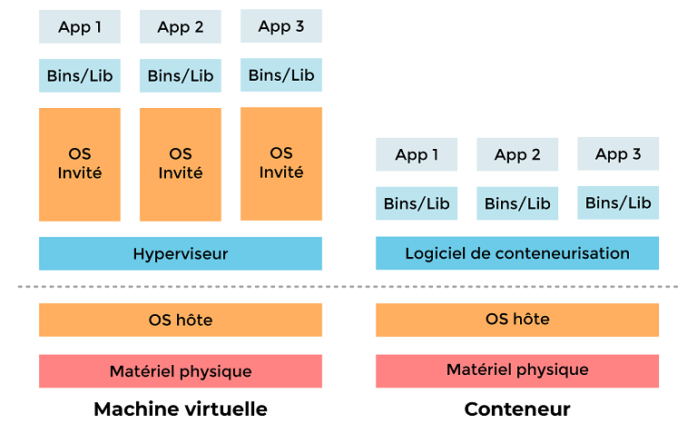

# Mémo Docker

Docker est un logiciel libre permettant de lancer des applications dans des conteneurs.

## La notion de conteneur

Les conteneurs sont proches des machines virtuelles, mais présentent un avantage important. Alors que la virtualisation consiste à exécuter de nombreux systèmes d'exploitation sur un seul et même système, les conteneurs se partagent le même noyau de système d'exploitation et isolent les processus de l'application du reste du système.

## Quelques commandes

Lancer un conteneur :

`$ docker run hello-world`

Avant de lancer le conteneur, Docker va vérifier si l'image hello-world est disponible en local. Si ce n'est pas le cas, il va la télécharger.

Télécharger une image sans lancer de conteneur :

`$ docker pull hello-world`

Lancer un conteneur NGINX :

`$ docker run -d -p 8080:80 nginx`

* `-d` lance le conteneur en arrière-plan
* `-p` transfert le trafic du port 8080 de la machine hôte vers le port 80 du conteneur

Lister les conteneurs actifs :

`$ docker ps`

Lister les conteneurs actifs et inactifs :

`$ docker ps -a`

Entrer dans un conteneur :

`$ docker exec -ti e71e6a13b6a3 bash`

Arrêter un conteneur :

`$ docker stop e71e6a13b6a3`

Démarrer un conteneur arrêté :

`$ docker start e71e6a13b6a3`

Supprimer un conteneur :

`$ docker rm e71e6a13b6a3`

Lister les images :

`$ docker images`

Supprimer une image :

`$ docker rmi hello-world`

## Liens utiles

<https://www.docker.com/>

<https://docs.docker.com/>

<https://openclassrooms.com/fr/courses/2035766-optimisez-votre-deploiement-en-creant-des-conteneurs-avec-docker>